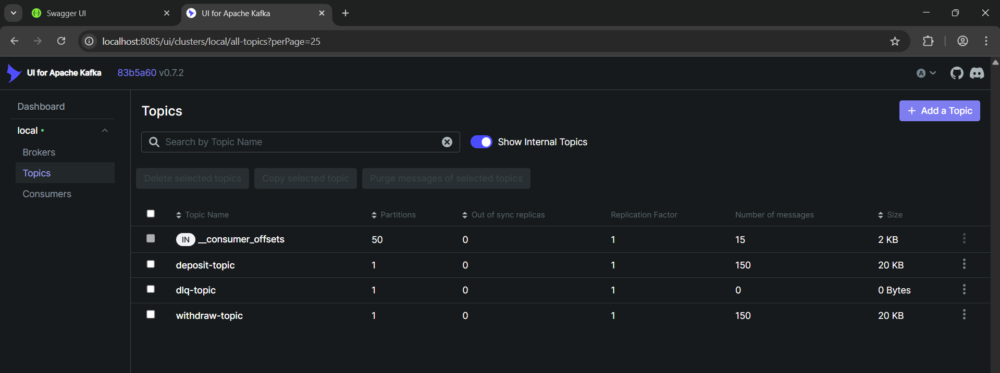
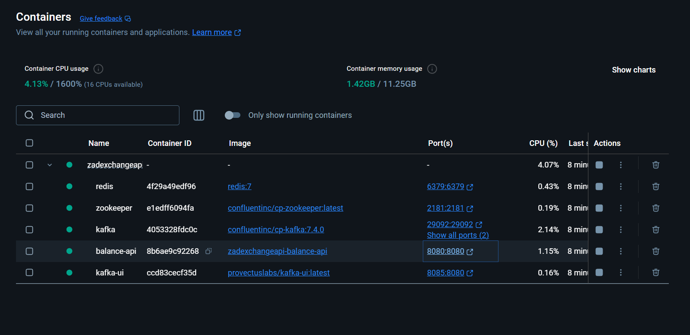
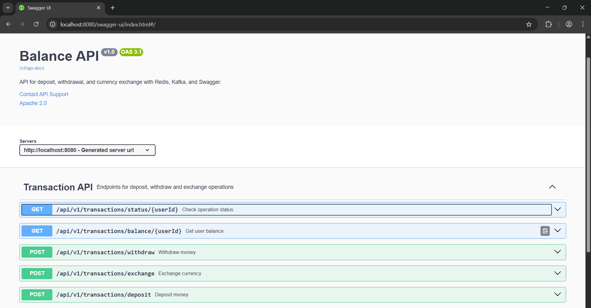
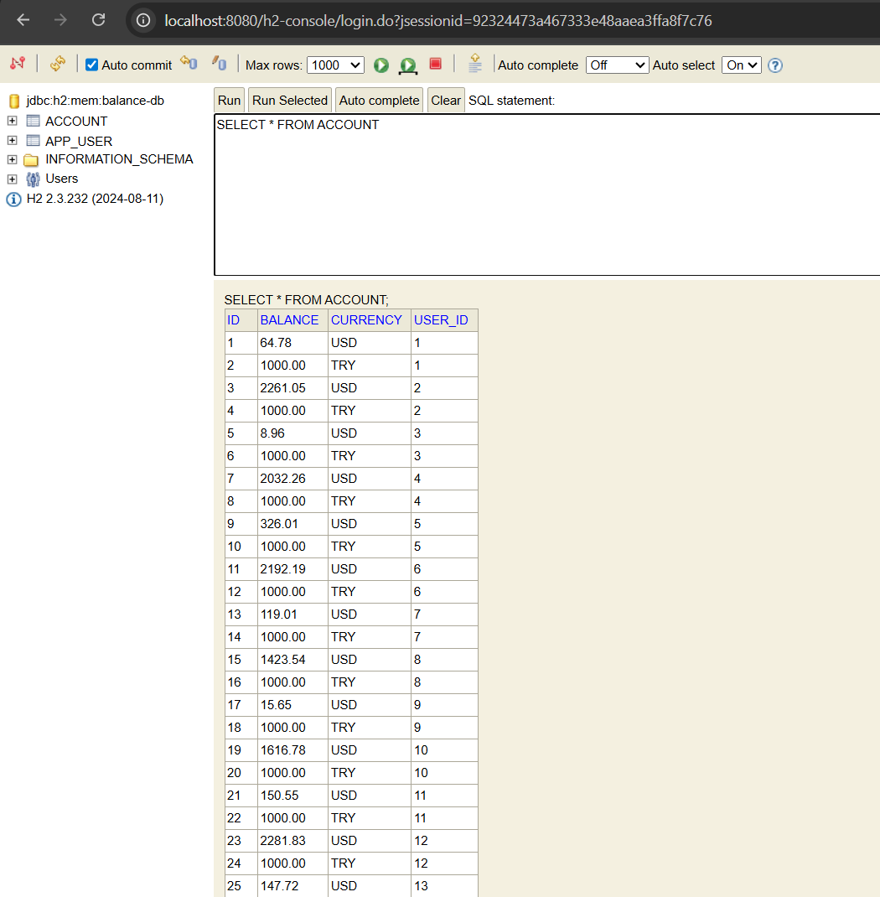
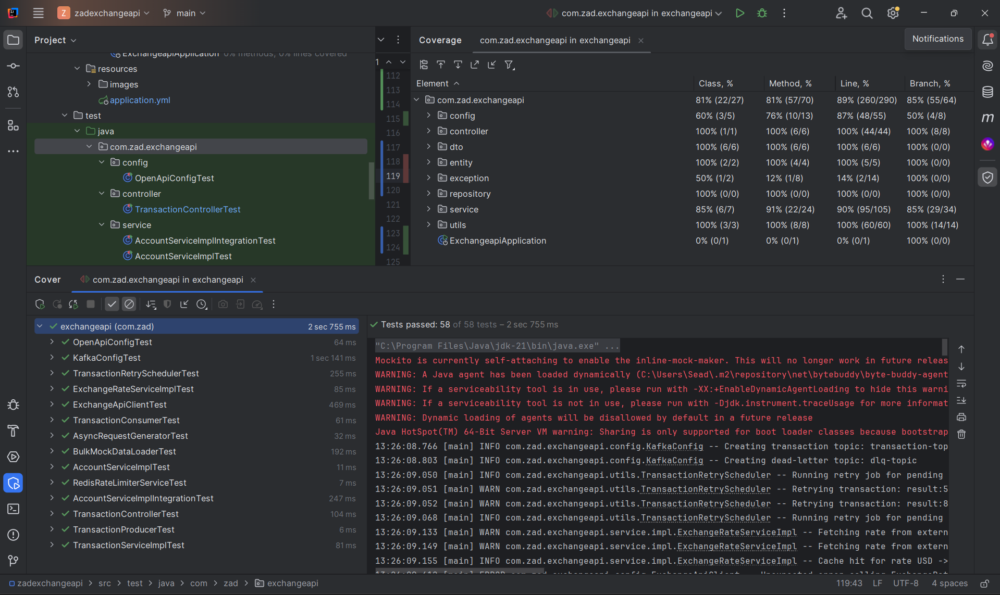

# 💱 Currency Conversion API
[](https://www.oracle.com/java/)  [](https://spring.io/projects/spring-boot)  [](https://maven.apache.org/)
[](https://www.h2database.com/)  [](https://swagger.io/)  [](https://junit.org/junit5/)

## ⚡️ Tech Stack
- **Java 21**: The core programming language.
- **Spring Boot 3.4.5**: Framework for building a scalable and secure API.
- **Spring Data JPA**: Data persistence with clean and efficient repositories.
- **H2 Database**: Lightweight in-memory database for fast and easy testing.
- **Lombok**: Reduces boilerplate code for entities and DTOs.
- **Maven**: Dependency management and build automation.
- **Swagger (Springdoc OpenAPI)**: API documentation.
- **JUnit 5**: Unit and integration testing.
- **Spring Retry**: Graceful handling of transient failures (e.g., exchange rate API)

---  

## 🚦 System Requirements
- **Java 21** or later
- **Maven 4.0.0** or later
- **Internet Connection** (for dependency download)
- **Any IDE (IntelliJ IDEA, Eclipse, VS Code)**

---  


## ⚙️ Project Overview

A robust, scalable API for managing user balances in USD and TRY currencies:

✅ Users can **deposit**, **withdraw**, **retrieve balance**, and **exchange currencies** between accounts in **TRY** and **USD**.

✅ Exchange rates retrieved from [https://www.exchangerate-api.com](https://www.exchangerate-api.com), valid for 1 minute  

✅ Withdraw and Deposit operations are **asynchronous** with status tracking.  

✅ Built with clean code principles, high test coverage, and Docker support.

✅ Rate limiter has been implemented to prevent abuse and enhancing system protection and stability.

## 🔥 Additional Features for Demonstration & Observability


- **Mock Users and Accounts:**  
  The application automatically generates demo users and initializes USD/TRY accounts with predefined balances on startup, simplifying local testing and demo scenarios.

- **Kafka UI Integration:**  
  A Kafka UI is bundled with the Docker setup, providing full visibility into Kafka topics, partitions, and message streams. Access to Kafka UI enables real-time tracking of all asynchronous operations for debugging and observability.

- **Scalability Demonstration via Load Generator:**  
  A scheduled cron job executes every **2 minutes**, sending 500 concurrent requests to simulate production-like load. This demonstrates application scalability, responsiveness under load, and ensures API availability during continuous operation.



---

## Run the Application

If you want to run the application, skipping the tests, please execute the following command. 

``` bash
mvn clean install -DskipTests=true
``` 

If you don't want to skip the tests, please execute the following command.

``` bash
mvn clean install
``` 

### Run with Docker
``` bash
docker-compose up --build
``` 



## 🌐 API Documentation

> Swagger UI: http://localhost:8080/swagger-ui/index.html

> H2 Console: http://localhost:8080/h2-console


## 🔑 Functional Endpoints
Base URL: http://localhost:8080/api/v1

| Method | Endpoint                         | Description                                             |
| ------ | -------------------------------- | ------------------------------------------------------- |
| POST   | `/transactions/deposit`          | Asynchronous deposit to a user's account (USD/TRY)      |
| POST   | `/transactions/withdraw`         | Asynchronous withdrawal from a user's account (USD/TRY) |
| GET    | `/transactions/balance/{userId}` | Retrieve user's current account balance                 |
| POST   | `/transactions/exchange`         | Exchange funds between USD and TRY for a user           |
| GET    | `/transactions/status/{userId}`  | Check latest deposit/withdraw status for user           |




## 🔁 Exchange Rate Handling
Real-time rates from https://www.exchangerate-api.com

Rates cached for 1 minute to ensure performance and consistency

Exchange operations only allowed between USD ↔️ TRY accounts




-----
## Testing 

-------
 
The project achieves an overall test coverage of **89% per line**.

- Core services, Kafka integration, Redis logic, and API endpoints are well covered.
- Critical scenarios such as valid transactions, invalid inputs, and error handling are tested.
- Some non-critical areas, like logging statements, auto-generated IDs, and occasional exception branches, remain partially uncovered.

In general, the codebase maintains strong, reliable test coverage, suitable for production environments.



-------